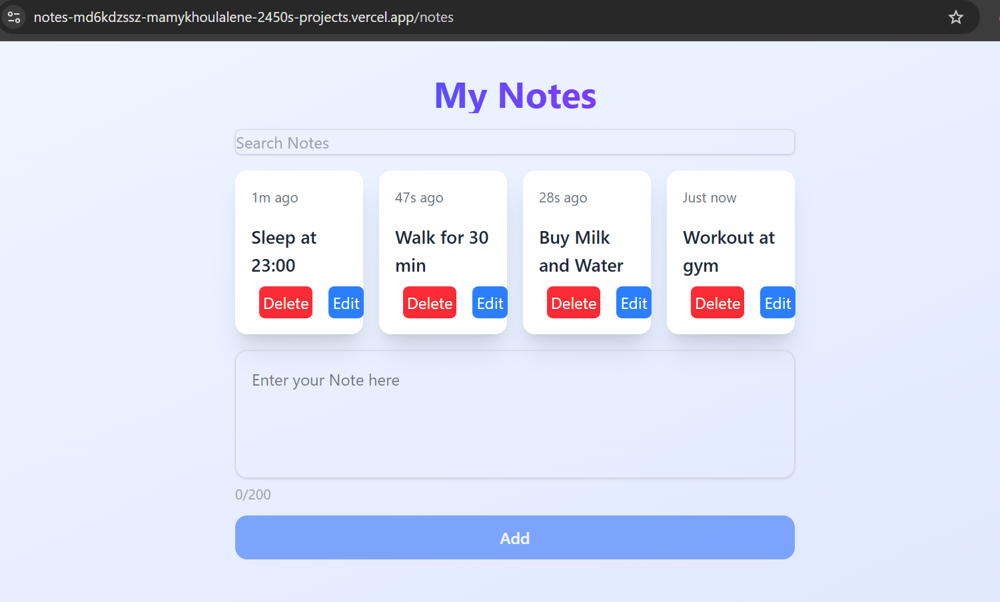

# 📝 Notes App

A modern, feature-rich note-taking application built with React and Tailwind CSS. Create, edit, organize, and search your notes with a beautiful responsive interface.


## ✨ Features

- **CRUD Operations** - Create, read, update, and delete notes
- **Real-time Search** - Filter notes instantly as you type
- **Character Counter** - Visual feedback with 200 character limit
- **Timestamps** - Relative time display ("Just now", "5m ago", "2d ago")
- **Edit Tracking** - Shows when notes were created and last edited
- **Responsive Grid** - 2 columns on mobile, 4 columns on desktop
- **Local Storage** - Notes persist across browser sessions
- **Keyboard Shortcuts** - Enter to add, Escape to cancel editing
- **Modern UI** - Clean design with hover effects and smooth transitions
- **Auto-resize Textarea** - Input grows with your content

## 🚀 Live Demo
https://notes-md6kdzssz-mamykhoulalene-2450s-projects.vercel.app/notes



## 🛠️ Tech Stack

- **Frontend:** React 18
- **Styling:** Tailwind CSS
- **Build Tool:** Vite
- **Deployment:** Vercel
- **State Management:** React Hooks (useState, useEffect)
- **Persistence:** LocalStorage API

## 📦 Installation

### Prerequisites

- Node.js (v16 or higher)
- npm or yarn

### Setup

1. **Clone the repository**
   ```bash
   git clone https://github.com/mamykhoulalene-star/notes-app.git
   cd notes-app
Install dependencies

bash
npm install
Start development server

bash
npm run dev
Open in browser

text
http://localhost:5173
📁 Project Structure
text
notes-app/
├── public/
├── src/
│   ├── components/
│   │   └── Notes.jsx          # Main notes component
│   ├── App.jsx                # Root component with routing
│   ├── App.css                # Global styles
│   ├── main.jsx               # Entry point
│   └── index.css              # Tailwind imports
├── index.html
├── package.json
├── tailwind.config.js
└── vite.config.js
🎯 Usage
Adding a Note
Type your note in the textarea at the bottom

Press Enter or click Add Note

Character counter shows remaining space (max 200 characters)

Editing a Note
Click the Edit button on any note

Modify the text in the textarea

Click Save or press Enter to confirm

Click Cancel or press Escape to discard changes

Deleting a Note
Click the Delete button on any note to remove it permanently

Searching Notes
Type in the search bar at the top

Notes filter in real-time as you type

Clear the search field to show all notes

Reading Timestamps
"Just now" - Less than 5 seconds ago

"Xs ago" - Less than a minute

"Xm ago" - Less than an hour

"Xh ago" - Less than 24 hours

"Xd ago" - Less than 7 days

"Mon DD" - Older than a week (e.g., "May 14")

⌨️ Keyboard Shortcuts
Shortcut	Action
Enter	Add new note (from input) / Save edit
Shift + Enter	New line in note
Escape	Cancel editing
🎨 Color Indicators
Color	Meaning
Gray	Normal character count
Orange	Approaching limit (150+ characters)
Red	Over character limit (200+)
🔧 Available Scripts
bash
# Development
npm run dev         # Start development server

# Production
npm run build       # Build for production
npm run preview     # Preview production build

# Linting
npm run lint        # Run ESLint
🚢 Deployment
Deploy to Vercel
Push your code to GitHub

Import project in Vercel

Configure build settings:

Framework: Vite

Build Command: npm run build

Output Directory: dist

Deploy

https://vercel.com/button

🤝 Contributing
Contributions are welcome! Feel free to:

Fork the repository

Create a feature branch (git checkout -b feature/amazing-feature)

Commit changes (git commit -m 'Add amazing feature')

Push to branch (git push origin feature/amazing-feature)

Open a Pull Request

📝 Planned Features
Pin important notes to top

Color categories/tags

Undo delete with toast notification

Bulk delete with multi-select

Dark mode support

Export notes as JSON/CSV

Markdown support

Custom hooks refactor

Unit tests with Vitest

🐛 Known Issues
Notes with very long words may overflow on mobile

Local storage has 5-10MB limit per domain

No backup/sync across devices (local only)

📄 License
This project is licensed under the MIT License - see the LICENSE file for details.

👤 Author
Samy Khoulalene

GitHub: @mamykhoulalene-star

Project Link: https://github.com/mamykhoulalene-star/notes-app

Live Demo: https://notes-md6kdzssz-mamykhoulalene-2450s-projects.vercel.app/

🙏 Acknowledgments
React Documentation

Tailwind CSS

Vite

Vercel

⭐️ If you find this project useful, please give it a star on GitHub!
